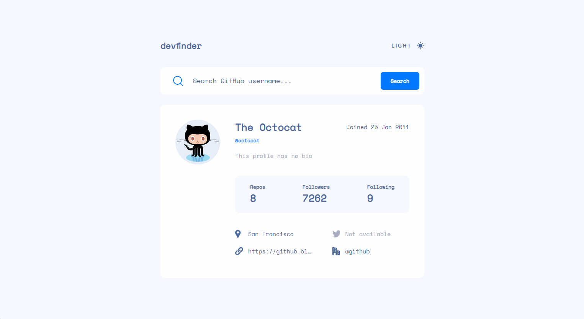

<p align="center"></p>

# devfinder

Devfinder is an app to search and find devs based on their username. You can read about then, when they joined GitHub, how many repositories and followers they have and have access to their personal information, such as location, company, Twitter and website.

## Screenshots




## Tech Stack

- [](https://www.typescriptlang.org/)
- [](https://reactjs.org/)
- [](https://styled-components.com/)
- [](https://jestjs.io/)

## Getting Started

Clone the project

```bash
  git clone https://github.com/renatarochaa/octocat-dev-search
```

Go to the project directory

```bash
  cd octocat-dev-search
```

Install dependencies

```bash
  npm install
```

Start the server

```bash
  npm start
```

To create a local build

```bash
  npm run build
```

## Running Tests

To run tests, run the following command

```bash
  npm test
```

## Authors

- [@renatarochaa](https://github.com/renatarochaa)
